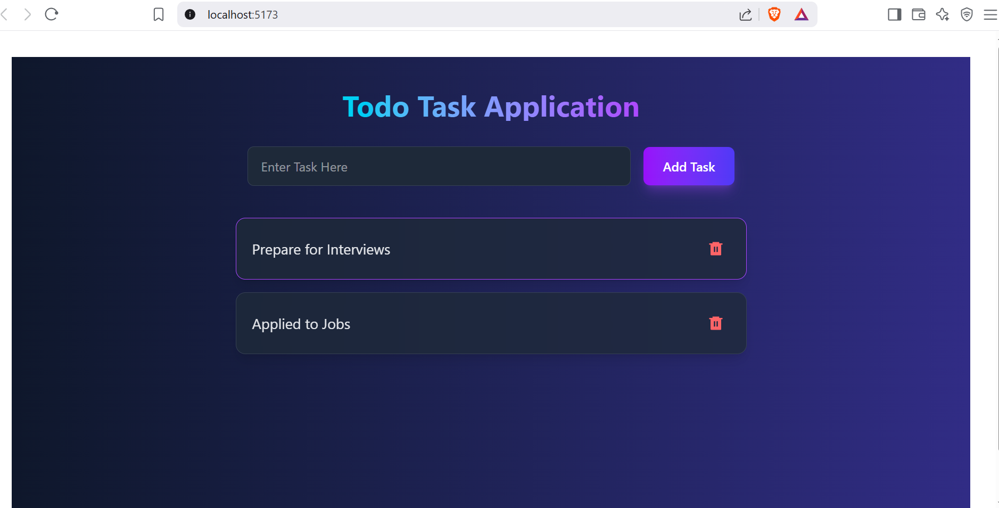

## 🎥 Demo Video

**[▶️ Watch the 1-minute demo](client/vite-project/src/assets/media/TODO_Demo.mp4)**
## 🖼️ Screenshot

MERN Stack Todo Application

This is a simple Todo Application built using the MERN stack: MongoDB, Express, React, and Node.js. The app allows users to add, update, delete, and view tasks in a simple interface.

Features

    CRUD Operations: Create, Read, Update, and Delete Todo tasks.

    Responsive UI: Built with React and styled using Tailwind CSS.

    Backend API: Uses Express and MongoDB to manage tasks.

    Real-Time Data Fetching: Task list is updated dynamically without page reload.

    Persistent Storage: Tasks are stored in MongoDB, so they persist even after app restarts.

Tech Stack

    Frontend:

        React.js

        Tailwind CSS (for styling)

        Axios (for API requests)

    Backend:

        Node.js

        Express.js

        MongoDB (via Mongoose for object modeling)

    Others:

        dotenv (for environment variables)
